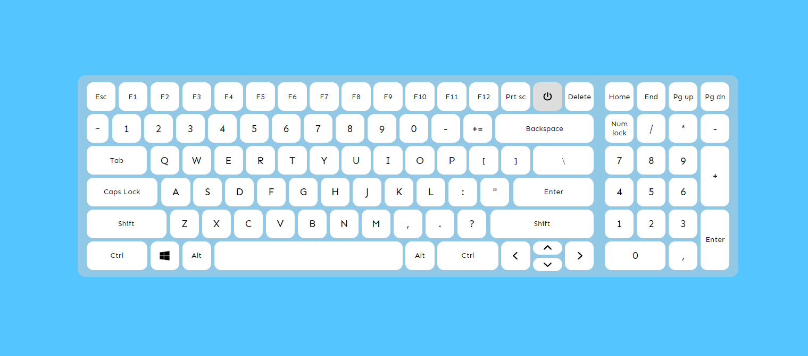

    <h1 align="center">Virtual Keyboard</h1>

- Virtual Keyboard using HTML, SASS and JavaScript;
- You can check your keyboard buttons;
- Pleasant and beautiful user interface;
- Simplicity and convenience

## Website - [https://frontenderboy.github.io/virtual-keyboard/](https://frontenderboy.github.io/virtual-keyboard/)

    

